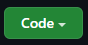

# Python-for-Students
### Lessons designed for middle and high school mathematics and to learn Python in the process!

### Contents
1. [Learning to Program!](#learning-to-program)
    1. [Why learn to program?](#why-learn-to-program)
    2. [What is programming?](#what-is-programming)
    3. [Why Python?](#why-python)
    4. [Getting Setup](#getting-setup)
2. [Variables and Types](#variables-and-types)
3. [Graphing with matplotlib](#graphing-with-matplotlib)
4. [Coming Soon!](#coming-soon)

## Learning to Program!

The following are some FAQ's that people have when approaching programming for the first time.

### Why learn to program?

Programming is a great way to complement problem-solving skills learned in subject areas, such as math and science. Applying what is learned in class allows for greater visualization and further engagment of ideas and theory to help reinforce what is being taught. Programming is also a great skill that helps develop better problem-solving skills and will help if the student wishes to pursue secondary education.

### What is programming?

A program is a set of instructions that tells the computer what to do. Coding is the practice of writing the code that the machine runs to do the task and programming is the problem-solving that goes into coming up to a solution that one wishes to solve.

### Why Python?

These lessons use the Python programming language for two main reasons:

1. **Readability**
2. **Scalability**

Python is a very readable language. It's syntax is relatively close to writing phrases in English, so it is rather approachable for a beginner. It also has a large community behind it that is great at answering questions and giving assistance. Python is very powerful and can scale as the student grows and learns more. Moving from elementary topics to more advanced ones, Python is a valuable tool that can help with schooling and can possibly lead to potential jobs in the future.

### Getting Setup

There are a couple approaches I would recommend for working through the following lessons. See below:
- [PyCharm Community](https://www.jetbrains.com/pycharm/download/#section=windows) (recommended)
- [Google Colab](https://colab.research.google.com/)
- [VSCode](https://code.visualstudio.com/)

Google Colab is an online platform that allows you to write and execute programs on the web browser. It may be the easiest route for those new to programming, but the platform isn't very friendly for working with the following lessons. PyCharm is a great IDE (Integrated Development Environment) for working with Python. It is widely used by Python developers and beginners alike. VSCode is a code editor that is chalked full of tools and works well with basically any language. This option may be a little more difficult for those to setup who have no experience with programming or setting up environments. Beginners may want to start with one of the former and try VSCode once they advance a bit more with programming.

I am writing this with the use of [PyCharm](https://www.jetbrains.com/pycharm/download/#section=windows) in mind. Pycharm is easy to install, use, and will be a good introduction to the programming environment. Please follow the instructions below to get PyCharm setup with the GitHub repo you are currently reading from:

1. Download and Start PyCharm, should see menu with => 'New Project', 'Open', and 'Get from VCS'
2. Go to [Python-for-Students](https://github.com/Samuel-DeSantis/Python-for-Students), if not there already, and click:

 

3. select "HTTPS" => Click the Copy button
4. PyCharm => "Get from VCS" => Paste the copied GitHub info into URL, then hit "Clone" and "Trust Project.
 
PyCharm should open with the Python-for-Students project open in the left column and the README.md file open on the right.

If you are here **CONGRATS** for getting the PyCharm IDE setup and running! Feel free to explore the different folders and lessons and we will get started with Variables and Types next!
## Variables and Types

The following table outlines what will be covered in the lessons for this section.

|   Name   |       Description       |
|:--------:|-------------------------|
| [lesson_1](###lesson_1) | Learning with Lessons   |
| [lesson_2](###lesson_2) | Variables and Types     |
| [lesson_3](###lesson_3) | Using Variables & Types |

Before we dive right in, it's customary to start learning a new programming language by writing a "Hello World" program. To do that, navgate to the **Python Console** tab at the bottom row in PyCharm. Write: 

`print("Hello World")`

and hit ENTER and it will run the program. 

Woot woot! You wrote your first line of Python code. The Python Console is a great place to experiment with running python code and seeing how things work. 

Next, navigate to the **Terminal** tab at the bottom row of the window and click on the drop down arrow for the Ubuntu option. There should be text that says "Python-for-Students" with a heart below and a blinking cursor. See the table below for some commands to navigate the directory. If you don't feel like a hacker yet, you will soon.

| Command |       Action        |
|:-------:|---------------------|
|   ls    | List folder contents|
|   cd    | Change directory    |
|  touch  | Create a file       |
|  mkdir  | Make directory      |
|  rmdir  | Remove directory    |

To navigate to a directory/folder do `cd [name of dir]` ex. `cd variables-and-types` to access the Variables and Types folder.

### lesson_1
Navigate to lesson_1 using => ` cd variables-and-types` => `cd lesson_1` from the `Python-for-Students` directory and expand the dropdowns in the left project column so you can see:

and open both `lesson_1.py` and `test_lesson_1.py` with either double clicking the files or selecting both files and pressing ENTER (Select one file, then hold CTRL and select the other file to highlight both).

In the Ubuntu Terminal that is open, run `./lesson_1.sh`. OH NO! We are getting 3 failed tests from the program! Look at the "short test summary info" to see what is missing. In `lesson_1.py` try entering in the correct colors in the single quotes for each of the fruits and run the program again.

```
def myFunction ():

    # What is the color of the fruit below:

    apple = 'red'
    orange = 'orange'
    banana = 'yellow'

    return [apple, orange, banana]

```
The above code is the solution to pass the tests and you should see "3 passed" in GREEN and above that

```
test_lesson_1.py
SUCCESS: APPLES ARE RED!
.SUCCESS: ORANGES ARE ORANGE!
.SUCCESS: BANANAS ARE YELLOW!
.
```

### lesson_2
### lesson_3

## Graphing with Matplotlib

## Coming Soon!
More coming soon!